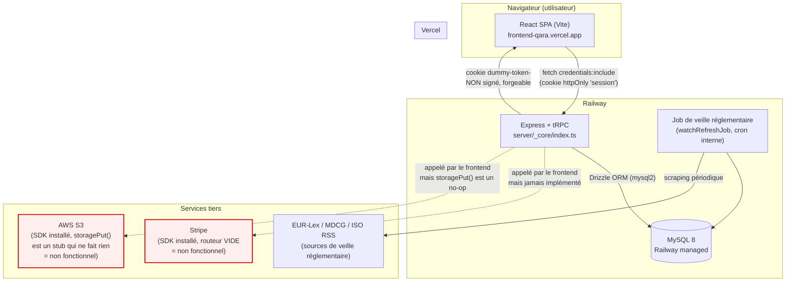
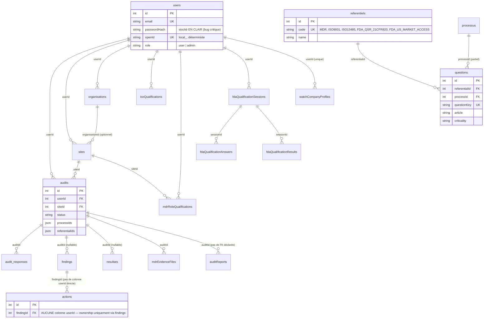

# Phase 1 — Compréhension du projet

**Périmètre analysé** : `nickandro96/backend---qara` (branche `main`, HEAD au 02/07/2026) et `nickandro96/frontend---qara` (branche `main`, HEAD au 02/07/2026).
**Méthode** : clonage local des deux dépôts, installation des dépendances, reconstitution d'une base MySQL locale à partir des migrations SQL versionnées (`scripts/apply-sql-migrations.ts`), import réel des questionnaires MDR/FDA, lancement du backend (`tsx watch server/_core/index.ts`) et tests fonctionnels réels via `curl` (inscription, connexion, lecture DB). Ce n'est donc pas une lecture statique seule : les comportements décrits ci-dessous ont été observés en conditions réelles sur une copie locale (aucune donnée de production touchée).

---

## 1. Stack technique exacte

### Backend (`nickandro96/backend---qara`, hébergé sur Railway)

| Composant | Techno | Version installée |
|---|---|---|
| Runtime | Node.js | 22.x (ESM, `"type": "module"`) |
| Framework HTTP | Express | 4.21.2 (installé 4.22.2) |
| API | tRPC | `@trpc/server` ^11.6.0 (installé 11.18.0) |
| ORM | Drizzle ORM | ^0.44.7 — **CVE haute sévérité non patchée** (voir 02-audit-technique.md) |
| Driver DB | mysql2 | ^3.16.3 |
| Base de données | MySQL 8.x (Railway managed) | — |
| Validation | Zod | ^4.1.12 |
| Paiement | Stripe SDK | ^20.2.0 — **installé mais non câblé** (routeur vide) |
| Stockage fichiers | @aws-sdk/client-s3 | ^3.693.0 — **installé mais jamais importé nulle part** |
| Génération documents | PDFKit, ExcelJS | 0.17.2 / 4.4.0 |
| Auth (déclarée) | jose, jsonwebtoken | installées, **jamais utilisées** |
| Migrations | Drizzle Kit + script maison `scripts/apply-sql-migrations.ts` | Drizzle Kit 0.31.4 |
| Tests | `node --test` (natif Node) | 5 tests, tous dans `server/services/watch/` |

### Frontend (`nickandro96/frontend---qara`, hébergé sur Vercel — https://frontend-qara.vercel.app/)

| Composant | Techno | Version |
|---|---|---|
| Framework | React | 19.2.1 |
| Build | Vite | 7.1.9 |
| Langage | TypeScript | 5.9.3, `strict: true` |
| UI | shadcn/ui + Tailwind CSS | 4.1.14 |
| Client API | `@trpc/react-query` + TanStack Query | 5.90.2 |
| i18n | react-i18next | fr.json / en.json |
| Export PDF | jsPDF | **CVE critique non patchée** (voir 02) |
| Routing | wouter | — |

### Dépendances obsolètes / vulnérables (résumé — détail complet en Phase 2)

- **Backend** : `drizzle-orm` 0.44.7 → injection SQL via identifiants mal échappés (GHSA-gpj5-g38j-94v9, High), patché en 0.45.2 ; `xlsx` 0.18.5 → prototype pollution + ReDoS, **aucun correctif disponible sur npm** (SheetJS ne publie le correctif que sur son propre CDN).
- **Frontend** : `npm audit` remonte 20 vulnérabilités (1 critique, 12 hautes, 6 modérées, 1 basse), dont `jspdf` (injection JS dans les PDF générés côté client) et `@trpc/server` 11.6.0 (dans la plage vulnérable à une faille de prototype pollution, corrigée en 11.8.0+).

---

## 2. Architecture réelle

**Points clés de l'architecture réelle** (et non celle documentée/supposée) :

1. **Authentification** : cookie httpOnly `session` (bon choix contre le XSS pour le *transport*), mais le **contenu** du cookie est `dummy-token-<openId>` — une chaîne non signée, non chiffrée. `openId` pour un compte email/mot de passe vaut `local_<email>` de façon déterministe. **Quiconque connaît l'email d'un utilisateur peut forger son cookie de session et l'usurper**, sans jamais passer par le login. Confirmé par lecture de code ET par test en local.
2. **Mots de passe** : stockés et comparés en clair (`hashPassword`/`verifyPassword` sont des fonctions identité). Confirmé par un test réel : après inscription d'un compte de test, la colonne `passwordHash` contenait littéralement `Test1234!`.
3. **Deux mécanismes de contournement total de l'authentification codés en dur** dans `server/_core/systemRouter.ts` :
   - `system.devLogin` : procédure **publique**, crée un compte admin pour n'importe quel email fourni et retourne un cookie de session valide.
   - Un **backdoor avec identifiants en dur** dans `system.login` (`nickandroklauss@gmail.com` / `Admin2026!`) qui, si utilisé, écrase le mot de passe existant et force le rôle `admin`.
   → **Signalé immédiatement au commanditaire lors de la découverte, conformément aux règles de travail.**
4. **Paiement (Stripe)** : le routeur `server/stripe/router.ts` est **littéralement vide** (`router({})`). Le SDK Stripe est une dépendance déclarée mais jamais instanciée nulle part dans `server/`. Le frontend appelle 4 procédures (`createCheckoutSession`, `createPortalSession`, `getSubscription`, etc.) qui n'existent pas côté serveur : **la facturation n'est pas implémentée**, pas juste buggée.
5. **Stockage de fichiers (S3)** : `server/storage.ts` exporte `storagePut = async () => {}` — un stub qui ne fait rien, alors que `@aws-sdk/client-s3` est déclaré en dépendance et n'est importé nulle part. **Aucune preuve documentaire (evidence) n'est réellement stockée.**
6. **Veille réglementaire** : seul module réellement abouti, avec un job de rafraîchissement périodique interne au process Express (pas un vrai cron/queue externe), qui scrape EUR-Lex MDR, MDCG, normes harmonisées, RSS ISO.
7. **CORS** : correctement restreint (pas de wildcard), origine `https://frontend-qara.vercel.app` + previews Vercel du projet.

---

## 3. Modèle de données

23 tables MySQL, définies dans `drizzle/schema.ts` (594 lignes). Seules 8 des ~23 tables ont un véritable `CREATE TABLE` versionné dans `drizzle/migrations/` — **les tables cœur (`users`, `audits`, `sites`, `organisations`, `findings`, `actions`, `resultats`, `audit_responses`, `questions`) n'ont aucune trace de création dans les migrations versionnées**, ce qui indique que le schéma de base a été créé hors du contrôle de version (probablement directement en base Railway), un point qui complique toute reconstitution fiable de l'environnement (confirmé : `drizzle-kit push --force` échoue avec une erreur MySQL sur un nom de contrainte trop long, preuve que le schéma déclaré dans le code et celui réellement en base ont divergé).

**Constats notables sur le modèle de données** :

- Le **référentiel MDR n'est structurellement pas au même niveau que ISO/FDA** : ISO et FDA utilisent le mécanisme générique `referentiels` → `questions` (table partagée). MDR, lui, dépend d'un mécanisme de repli (`server/fallback-data.ts` charge un fichier `server/all-questions-data.json` qui **n'existe pas dans le dépôt**) en plus d'un import Excel dédié (`scripts/import-mdr-questions.js`, cassé — voir Phase 2). Sur une base fraîchement migrée à partir des seules migrations versionnées, **le référentiel MDR n'existe même pas dans la table `referentiels`** (id=1 absent) et **ISO 9001 / ISO 13485 ont 0 question chacun**. Seuls FDA_QSR_21CFR820 (30 questions) et FDA_US_MARKET_ACCESS (193 questions) sont peuplés par les migrations SQL versionnées.
- `findings.userId` et `resultats.userId` sont **nullables** (contrairement à la quasi-totalité des autres colonnes de rattachement), ce qui est incohérent avec le reste du modèle et représente un risque latent d'enregistrements orphelins non rattachables à un utilisateur.
- `actions` n'a **aucune colonne de rattachement direct** (ni `userId` ni `organisationId`) — l'appartenance ne se déduit qu'en remontant par `findingId → findings.userId`. Aucune procédure actuelle n'expose un accès direct par `actionId` (donc pas d'IDOR exploitable aujourd'hui), mais toute future route qui accepterait un `actionId` brut sans re-vérifier la chaîne de propriété serait une IDOR immédiate.
- `auditReports.userId`/`auditReports.auditId` sont des `int` simples **sans `.references()` Drizzle du tout**, contrairement à toutes les autres tables — incohérence de modélisation (le filtrage applicatif est correct, mais rien ne le garantit au niveau schéma).
- Seules 3 relations sur ~15 ont une vraie contrainte `FOREIGN KEY` en base (`iso_qualifications`, `watch_company_profiles`, les tables `fda_qualification_*`). Le reste (`users`, `audits`, `sites`, `organisations`, `findings`, `actions`, `resultats`, `audit_responses`) **n'a probablement aucune intégrité référentielle réelle en base** — uniquement au niveau applicatif.

---

## 4. Inventaire fonctionnel exhaustif

Légende : ✅ fonctionne · ⚠️ partiellement fonctionnel · ❌ cassé (bug reproductible) · 🚧 non implémenté / orphelin.

### 4.1 Pages frontend (`client/src/pages/`, 55 fichiers, routes vérifiées dans `client/src/App.tsx`)

| Page | Route | Statut | Constat |
|---|---|---|---|
| ModernHome.tsx | `/` | ✅ | Page marketing, statique |
| Home.tsx | `/home-old` | ⚠️ | Ancienne home conservée en route morte |
| Login.tsx | `/login` | ✅ | Fonctionnel, mais aucune classe responsive |
| LoginPassword.tsx | non routée | 🚧 | Orpheline |
| Register.tsx | `/register` | ✅ | Testé en réel : l'inscription fonctionne (voir Phase 2 pour le bug du mot de passe en clair) |
| ActionDashboard.tsx | `/action-dashboard` | ❌ | **100% données factices codées en dur**, 0 appel tRPC malgré une page routée en production (commentaire explicite dans le code : *"Données de démonstration - à remplacer"*) |
| Classification.tsx | `/classification` | ✅ | Page la plus volumineuse du front (1352 lignes), câblée sur `trpc.classification.classify` |
| Dashboard.tsx | `/dashboard` | ❌ | Appelle `trpc.badges.*`, namespace inexistant côté serveur |
| DashboardV2.tsx | `/dashboard-v2` | ✅ | |
| DashboardExecutive.tsx | `/dashboard-executive` | ✅ | |
| AnalyticsDashboard.tsx | `/analytics` | ❌ | **100% données factices**, exports CSV/PDF non implémentés (TODO explicites) |
| FDAQualification.tsx | `/us/fda-qualification` | ✅ | |
| FDAAudit.tsx / FdaAudit.tsx | `/us/fda-audit` et `/fda-audit` | ❌ | **Fichiers strictement identiques dupliqués**, appellent en plus des namespaces `ai`, `evidence`, `questions` inexistants côté serveur |
| FdaClassification.tsx | `/fda-classification` | ❌ | `trpc.fdaClassification.save` inexistant |
| FdaDashboard.tsx | `/us/fda-dashboard`, `/fda-dashboard` | ✅ | Doublement montée sur 2 routes |
| FdaDocuments.tsx / FdaReports.tsx | `/us/fda-documents`, `/us/fda-reports` | ✅ | |
| FdaRegulatoryWatch.tsx | `/fda-regulatory-watch` | ❌ | `trpc.fdaRegulatoryWatch.*` inexistant |
| FdaSubmissionTracker.tsx | `/fda-submission-tracker` | ⚠️ | Mélange données mock + réelles concaténées |
| FdaWatchRoadmap.tsx | `/us/fda-watch` | 🚧 | Placeholder explicite ("prêt pour un futur module") |
| ISOQualification.tsx, ISOAuditWizard.tsx, ISOAuditDrilldown.tsx, ISOAuditReview.tsx | `/iso/*` | ✅ | Chaîne ISO fonctionnelle **si** les questions ISO existent en base (actuellement 0 — voir §3) |
| ISOAudit.tsx | non routée | 🚧 | Orpheline, supplantée par ISOAuditWizard |
| MDRAudit.tsx (+ Drilldown, Review) | `/mdr/audit*` | ✅ | Chaîne MDR fonctionnelle, la plus volumineuse (837-1046 lignes) |
| MDRAudit.tsx.bak | — | — | **Fichier de sauvegarde committé dans git**, doit être supprimé |
| MDRQualification.tsx | `/mdr/*` (via `MdrRoutesErrorBoundary`) | ⚠️ | Accessible mais via une indirection de routage inutilement complexe (triple déclaration des routes MDR : App.tsx, `mdrRoutes.tsx` mort, `MdrRoutesErrorBoundary.tsx`) |
| Audit.tsx | **non routée du tout** | 🚧 ❌ | Page orpheline en plus d'appeler `trpc.questions.*` inexistant |
| AuditDetail.tsx | `/audit/:id` | ❌ | `trpc.findings.*` et `trpc.actions.*` inexistants |
| AuditHistory.tsx | `/audit-history` | ⚠️ | Export PDF en TODO |
| AuditResults.tsx, AuditComparison.tsx, AuditsList.tsx | `/audit/*` | ✅ | |
| ComponentShowcase.tsx | non routée | 🚧 | Catalogue de composants shadcn, 1437 lignes, totalement inaccessible en prod |
| Contact.tsx, AdminContacts.tsx | `/contact`, `/admin/contacts` | ❌ | `trpc.contact.*` inexistant |
| AdminUsers.tsx | `/admin/users` | ✅ | |
| Documents.tsx | `/documents` | ❌ | `trpc.documents.*` (6 appels) inexistant |
| Reports.tsx, ReportGeneration.tsx, ReportHistory.tsx, ReportComparative.tsx | `/reports/*` | ⚠️ | Génération PDF câblée mais **plante systématiquement côté serveur** (voir Phase 2, §S3/Stripe) ; comparaison d'audits appelle `db.compareAudits` qui n'existe pas |
| RegulatoryWatch.tsx | `/regulatory-watch` | ❌ | `trpc.regulatory.*` inexistant (seul `watch.*` existe réellement) |
| WatchDashboard.tsx | `/watch-dashboard` | ⚠️ | Mélange `watch.*` (réel) et `regulatory.getStats` (fantôme) |
| SiteManagement.tsx | `/settings/sites` | ✅ | |
| Pricing.tsx, Subscription*.tsx | `/pricing`, `/subscription*` | ❌ | Tout ce qui touche Stripe est non fonctionnel côté serveur (routeur vide) |
| Profile.tsx, FAQ.tsx, NotFound.tsx | — | ✅ | |

**Synthèse** : sur 55 pages, environ **24 sont pleinement fonctionnelles**, **13 sont partiellement cassées** (appellent au moins une route tRPC fantôme), **10 sont franchement cassées** (page entière non fonctionnelle : facturation, contact, documents, findings/actions, IA, dashboard "badges"), et **8 sont orphelines/mortes** (jamais routées).

### 4.2 Endpoints API backend (tRPC, `server/routers.ts` + routeurs dédiés)

Inventaire complet (~90 procédures) disponible dans `02-audit-technique.md` §1. Résumé :

- **Fonctionnels et réellement appelés par le frontend** : ~55 procédures (auth, profil, sites, organisations, référentiels, MDR/ISO/FDA audit complet, classification, veille réglementaire, dashboard v2).
- **Fantômes** (appelés par le frontend, absents du backend) : `ai.*`, `actions.*`, `badges.*`, `contact.*`, `demo.*`, `documents.*`, `evidence.*`, `fdaClassification.*`, `fdaRegulatoryWatch.*`, `findings.*`, `questions.*`, `regulatory.*`, `subscription.*`, et la majorité de `audit.*` (singulier — collision avec `audits.*` pluriel, qui lui existe mais n'est pas appelé).
- **Morts côté backend** (existent, jamais appelés) : ~18 procédures, dont le routeur `site` (singulier) entièrement doublonné par `sites` (pluriel), `system.devLogin` (qui est pourtant une faille active, voir Phase 2).
- **Cassés à l'exécution même quand ils existent** : `reports.generate` (plante sur l'upload S3 stub, puis sur un `.returning()` invalide en MySQL), `reports.compare` (`db.compareAudits` n'existe pas).

### 4.3 Modules "veille réglementaire" (le plus abouti)

Sources : EUR-Lex MDR, MDCG, normes harmonisées, flux RSS ISO. Enrichissement via `ImpactScorer`, `DomainMapper`, déduplication par hash. Playbooks (risque, UDI, PMS, étiquetage, vigilance, logiciel). **Seul module testé** (5 tests unitaires/intégration, tous passants). Fonctionnel mais son job de rafraîchissement tourne **dans le process Express lui-même** (pas de worker/queue séparé), ce qui n'est pas idéal en environnement serverless/multi-instance.

### 4.4 Code mort, TODO/FIXME, artefacts

- `client/src/pages/MDRAudit.tsx.bak` — committé dans git, à supprimer.
- `client/public/__manus__/debug-collector.js` et `dist/__manus__/debug-collector.js` — script de télémétrie d'un ancien hébergeur ("Manus"), non chargé activement mais toujours servi en statique.
- `dist/` (build) **committé dans le dépôt frontend** alors que `.gitignore` l'exclut explicitement — incohérence, probablement un ajout forcé historique jamais nettoyé.
- Domaine mort **`mdrcompliance-jqqkzfyu.manus.space`** (ancien hébergeur) présent en dur dans : `client/index.html`, `dist/index.html`, `HreflangTags.tsx`, `robots.txt`, `sitemap.xml`, et un lien d'aide en dur dans `Subscription.tsx` (`https://help.manus.im`) — **tout le SEO du site pointe vers un domaine mort**, à corriger avant toute mise en avant commerciale.
- Deux TODO explicites dans `server/report-generator.ts` (comparaison d'audits jamais implémentée, se rabat silencieusement sur un rapport exécutif).
- Composants et pages jamais importés nulle part : `ManusDialog.tsx`, `AuditSelector.tsx`, `AuditCreationDialog.tsx`, `AuditHeaderPanel.tsx`, `UpgradePrompt.tsx`, `Map.tsx` (référence un domaine `forge.butterfly-effect.dev` sans rapport avec le produit), `mdrRoutes.tsx`.
- ~18 procédures backend mortes (voir §4.2).
- **Aucun secret réel codé en dur trouvé** (pas de clé AWS, pas de clé Stripe live/test) — en revanche, voir Phase 2 pour le **backdoor d'authentification codé en dur**, qui est une découverte plus grave qu'un secret classique (signalée immédiatement lors de la découverte).

---

## 5. Flux d'authentification et gestion des rôles (tel qu'il fonctionne réellement)

1. `POST /trpc/system.register` → mot de passe stocké **en clair** dans `users.passwordHash`, `openId = local_<email>`.
2. `POST /trpc/system.login` → vérifie `password === passwordHash` (comparaison directe) ; si succès, pose un cookie httpOnly `session` contenant `dummy-token-<openId>` (non signé) ; **sauf** si l'email/mot de passe correspond au backdoor codé en dur, auquel cas le mot de passe est réécrasé et le rôle forcé à `admin`.
3. Chaque requête protégée : `server/_core/trpc.ts` lit le cookie `session`, vérifie juste que la chaîne commence par `dummy-token-`, extrait le `openId`, recharge l'utilisateur — **aucune vérification cryptographique**.
4. Rôles : `user` / `admin`, portés par `users.role`, vérifiés via `adminProcedure`. Le rôle admin peut être obtenu via le backdoor ci-dessus ou via `system.devLogin` (public, sans mot de passe).
5. Scoping des données : quasi systématiquement par `userId` (pas d'organisation-level isolation réelle malgré l'existence des tables `organisations`/`sites`) — voir Phase 2 pour le détail de l'audit IDOR complet (résultat : pas d'IDOR exploitable **au niveau des filtres SQL eux-mêmes**, mais l'authentification étant intégralement contournable, ce filtrage est en pratique sans effet protecteur réel).
